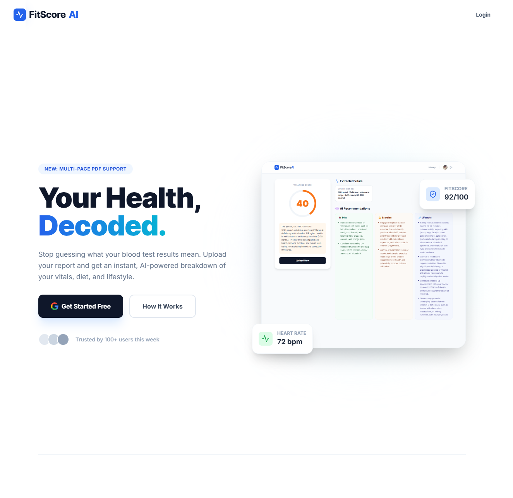
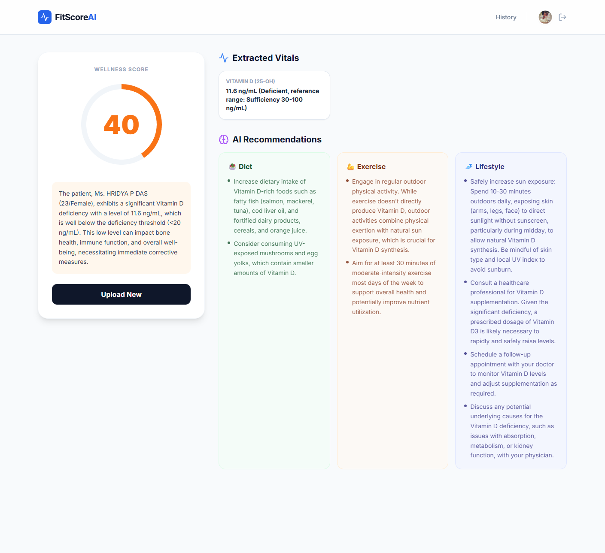
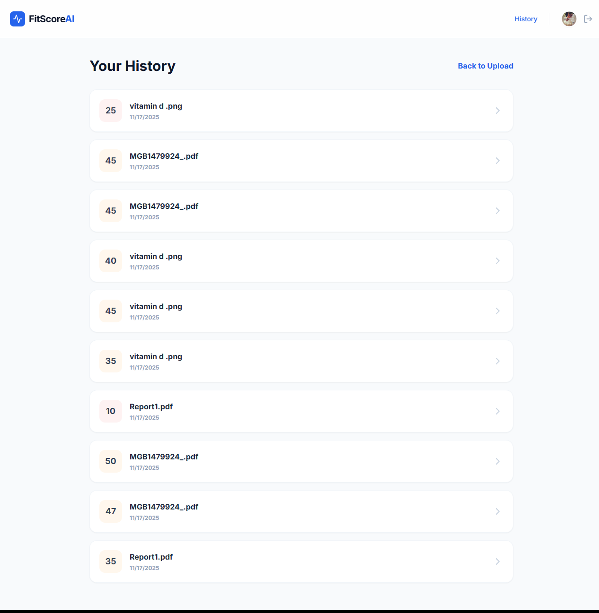

# 🩺 FitScore AI – Personalized Health Score and Insights from Medical Reports


**FitScore AI** is a modern, serverless application that turns complex medical reports into clear, actionable health insights. Powered by **Google Gemini 1.5 Pro (Multimodal)**, it scans blood tests and medical PDFs to extract vitals, calculate a wellness score, and generate personalized diet and lifestyle recommendations.

---

## 🚀 Key Features

* **📄 Multimodal Analysis:** Upload **Images (JPG/PNG)** or **Multi-page PDFs**. Gemini reads raw documents directly from Cloud Storage.
* **🧠 AI-Powered Diagnostics:** Extracts 30+ key vitals (Hemoglobin, Glucose, Cholesterol, etc.) and cross-references them with healthy ranges.
* **📊 The "FitScore":** A proprietary algorithm that condenses complex lab data into a single 0-100 wellness score.
* **🥗 Actionable Plans:** Generates specific, AI-written recommendations for **Diet**, **Exercise**, and **Lifestyle** improvements.
* **📜 Historical Tracking:** Users can sign in to save reports and track their health journey over time.
* **🔐 Enterprise Security:** Fully secured with Firebase Authentication and Google Cloud IAM service identities.

---

## 📸 Screenshots

| **Landing Page** | **AI Dashboard** |
|:---:|:---:|
|  |  |

| **History View**
|:---:|
|  |

---

## 🏗️ Architecture

FitScore AI follows a **Monorepo** structure deployed as a single container on **Cloud Run**.

```
graph TD
    User[👤 User] -->|HTTPS| React[⚛️ React Frontend (Vite)]
    React -->|Auth| Firebase[🔥 Firebase Auth]
    React -->|API POST| Node[🚀 Node.js Backend]
    
    subgraph Google Cloud Platform
        Node -->|1. Stream File| GCS[📦 Cloud Storage]
        Node -->|2. Analyze (Multimodal)| Gemini[🧠 Vertex AI (Gemini 1.5)]
        Node -->|3. Read/Write Data| Firestore[🗄️ Firestore Database]
    end
    
    Gemini -->|JSON Response| Node
    Node -->|Data + Score| React
````

1.  **Frontend:** React + TailwindCSS (animations via Framer Motion).
2.  **Backend:** Node.js (Express) handles file upload streams.
3.  **Storage:** Files are stored in a **private GCS bucket**.
4.  **AI Engine:** The backend passes the GCS URI + MIME type to **Vertex AI**, where Gemini 1.5 Flash extracts data and generates advice in JSON format.
5.  **Database:** Results are indexed by User ID in **Firestore** for history retrieval.

-----

## 🛠️ Tech Stack

  * **Frontend:** React 18, Vite, TailwindCSS, Framer Motion, Lucide Icons.
  * **Backend:** Node.js, Express, Multer (Memory Storage).
  * **Google Cloud:**
      * **Cloud Run:** Serverless container deployment.
      * **Vertex AI:** Gemini 1.5 Flash model.
      * **Cloud Storage:** Blob storage for reports.
      * **Firestore:** NoSQL database for user history.
      * **Firebase Auth:** Google Sign-In.

-----

## ⚡ Getting Started Locally

### 1\. Prerequisites

  * Node.js (v18+)
  * Google Cloud Project with Billing Enabled.
  * Service Account Key (`service-account-key.json`) with permissions: `Storage Object Admin`, `Vertex AI User`, `Firebase Admin`.

### 2\. Clone & Install

```bash
git clone [https://github.com/YOUR_USERNAME/FitScoreAI.git](https://github.com/YOUR_USERNAME/FitScoreAI.git)
cd FitScoreAI

# Install Backend Deps
npm install

# Install Frontend Deps
cd frontend
npm install
```

### 3\. Configuration

Create a `.env` file in the **root** directory:

```env
PORT=3000
GOOGLE_CLOUD_PROJECT_ID=your-project-id
GOOGLE_CLOUD_LOCATION=us-central1
GCS_BUCKET_NAME=your-bucket-name
GOOGLE_APPLICATION_CREDENTIALS=./service-account-key.json
```

Create a `.env` file in the **frontend** directory:

```env
VITE_API_KEY=your-firebase-api-key
VITE_AUTH_DOMAIN=your-project.firebaseapp.com
# ... other firebase config
VITE_API_URL=http://localhost:3000
```

### 4\. Run Locally

**Backend:**

```bash
# In root folder
node index.js
```

**Frontend:**

```bash
# In frontend folder
npm run dev
```

-----

## 🚢 Deployment

The app is containerized using Docker and deployed to **Google Cloud Run**.

### 1\. Build the Frontend

Compile the React app into static files served by the backend.

```bash
cd frontend
npm run build
cd ..
rm -rf public/*
cp -r frontend/dist/* public/
```

### 2\. Deploy to Cloud Run

```bash
gcloud run deploy fitscore-backend \
  --source . \
  --project YOUR_PROJECT_ID \
  --region us-central1 \
  --allow-unauthenticated \
  --clear-base-image \
  --service-account YOUR_SERVICE_ACCOUNT_EMAIL \
  --set-env-vars GCS_BUCKET_NAME=your-bucket,GOOGLE_CLOUD_PROJECT_ID=your-id,GOOGLE_CLOUD_LOCATION=us-central1
```

-----

## 📄 License

This project is licensed under the MIT License.

-----

*Built with ❤️ for the Google Cloud Build & Blog Marathon.*

```
```